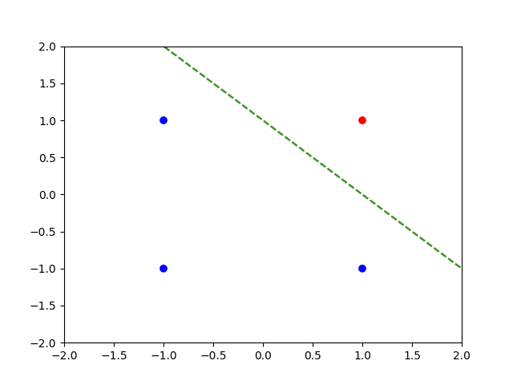
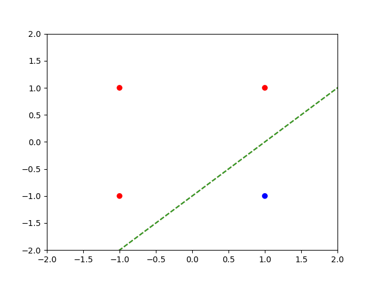
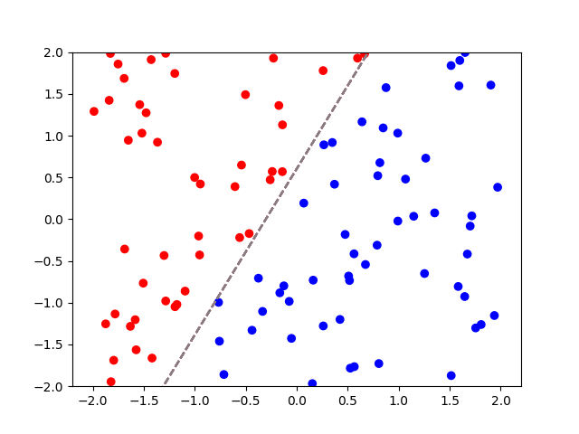

# Writing a perceptron from scratch

This small repo contains code for a perceptron binary classifier and visualizes the results.

AND operator:

Material implication:

Randomly generated data set (linearly separable):

## Backlog

- Perhaps add GIF functionality
- Add non linearly separable data to showcase non-convergence
